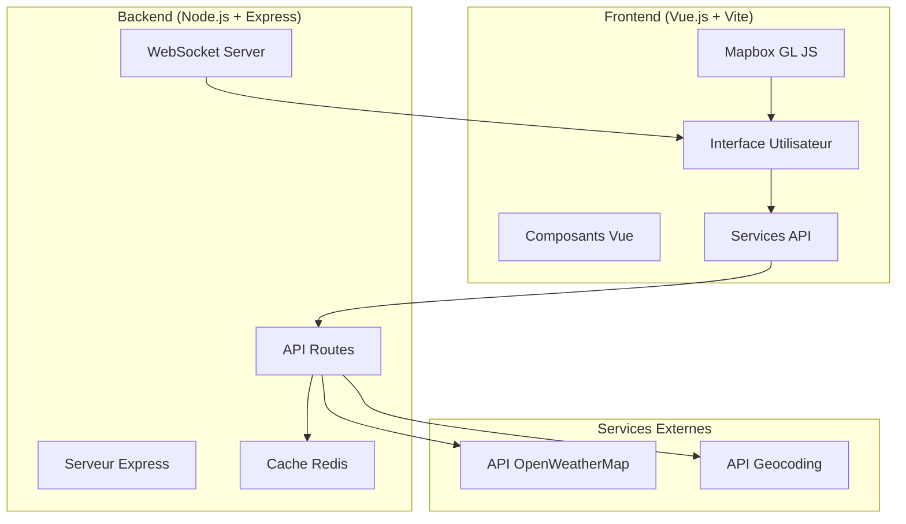

# 🌦️ Application Météo Interactive

Une application web moderne de visualisation météorologique avec carte interactive, développée dans le cadre de la SAE302.

## 📋 Table des matières

- [🎯 À propos du projet](#-à-propos-du-projet)
- [🏗️ Architecture](#️-architecture)
- [✨ Fonctionnalités](#-fonctionnalités)
- [🛠️ Technologies utilisées](#️-technologies-utilisées)
- [📦 Installation](#-installation)
- [🚀 Démarrage](#-démarrage)
- [📁 Structure du projet](#-structure-du-projet)
- [🔧 Configuration](#-configuration)
- [🌐 API](#-api)
- [🤝 Contributeurs](#-contributeurs)
- [📄 Licence](#-licence)

## 🎯 À propos du projet

Cette application météo interactive permet aux utilisateurs de :

- Visualiser la météo actuelle en temps réel
- Consulter les prévisions horaires et journalières
- Naviguer sur une carte interactive (Mapbox)
- Rechercher des villes par nom
- Obtenir sa position géographique automatiquement
- Recevoir des alertes météorologiques

L'application utilise une architecture moderne client-serveur avec mise en cache Redis et communication WebSocket pour les mises à jour en temps réel.

## 🏗️ Architecture



## ✨ Fonctionnalités

### 🗺️ Carte Interactive

- **Navigation fluide** : Zoom, déplacement, rotation 3D
- **Clic pour météo** : Cliquez sur n'importe quel point pour obtenir la météo
- **Géolocalisation** : Bouton pour centrer sur votre position
- **Reset orientation** : Retour à l'orientation Nord

### 🌤️ Données Météorologiques

- **Météo actuelle** : Température, ressenti, humidité, vent, pression
- **Prévisions horaires** : 48h à l'avance
- **Prévisions journalières** : 7 jours à l'avance
- **Alertes météo** : Notifications d'événements climatiques

### 🔍 Recherche et Navigation

- **Recherche de ville** : Autocomplétion et géocodage
- **Historique des recherches** : Sauvegarde locale
- **Interface responsive** : Adaptation mobile et desktop

### ⚡ Performance

- **Cache intelligent** : Redis pour optimiser les requêtes API
- **Mise à jour temps réel** : WebSocket pour les notifications
- **TTL configurable** : Cache adaptatif selon le type de données

## 🛠️ Technologies utilisées

### Frontend

- **Vue.js 3** - Framework JavaScript progressif
- **Vite** - Build tool rapide et moderne
- **Tailwind CSS** - Framework CSS utilitaire
- **Mapbox GL JS** - Cartes interactives
- **Font Awesome** - Icônes vectorielles

### Backend

- **Node.js** - Runtime JavaScript serveur
- **Express.js** - Framework web minimaliste
- **Redis** - Base de données en mémoire pour le cache
- **WebSocket (ws)** - Communication temps réel
- **Axios** - Client HTTP pour les API externes

### DevOps

- **Docker & Docker Compose** - Containerisation
- **Nodemon** - Rechargement automatique en développement
- **dotenv** - Gestion des variables d'environnement

### APIs Externes

- **OpenWeatherMap API** - Données météorologiques
- **Geocoding API** - Conversion adresse ↔ coordonnées

## 📦 Installation

### Prérequis

- [Node.js](https://nodejs.org/) (version 16 ou supérieure)
- [Docker](https://www.docker.com/) et [Docker Compose](https://docs.docker.com/compose/)
- Clé API [OpenWeatherMap](https://openweathermap.org/api) (gratuite)

### Installation locale

1. **Cloner le repository**

```bash
git clone https://github.com/opsiexe/SAE302-LD-MV-MD.git
cd SAE302-LD-MV-MD
```

2. **Configuration du backend**

```bash
cd backend
npm install
```

3. **Configuration du frontend**

```bash
cd ../frontend
npm install
```

4. **Variables d'environnement**
   Créer un fichier `.env` dans le dossier `backend/` :

```env
# API OpenWeatherMap
OPENWEATHER_API_KEY=votre_clé_api_ici

# Configuration serveur
PORT=5000
NODE_ENV=development

# Configuration Redis
REDIS_URL=redis://localhost:6379

# Configuration cache (en secondes)
CACHE_TTL_CURRENT=300    # 5 minutes pour météo actuelle
CACHE_TTL_FORECAST=3600  # 1 heure pour prévisions
```

### Installation Docker (Recommandée)

```bash
# Cloner et lancer avec Docker Compose
git clone https://github.com/opsiexe/SAE302-LD-MV-MD.git
cd SAE302-LD-MV-MD
docker-compose up --build
```

## 🚀 Démarrage

### Développement local

1. **Démarrer Redis**

```bash
# Avec Docker
docker run -d -p 6379:6379 redis:7

# Ou avec installation locale de Redis
redis-server
```

2. **Démarrer le backend**

```bash
cd backend
npm run dev
# Serveur disponible sur http://localhost:5000
```

3. **Démarrer le frontend**

```bash
cd frontend
npm run dev
# Application disponible sur http://localhost:3000
```

### Production avec Docker

```bash
# Démarrage de tous les services
docker-compose up -d

# Vérifier le statut
docker-compose ps

# Logs en temps réel
docker-compose logs -f
```

## 📁 Structure du projet

```
SAE302-LD-MV-MD/
├── 📄 README.md                 # Documentation du projet
├── 📄 LICENCE                   # Licence MIT
├── 🐳 docker-compose.yml        # Configuration Docker
├── 🐳 docker-compose.network.yml # Configuration réseau Docker
├──
├── 📂 backend/                  # API Node.js + Express
│   ├── 🐳 Dockerfile           # Image Docker backend
│   ├── 📦 package.json         # Dépendances Node.js
│   └── 🚀 server.js            # Point d'entrée serveur
│
└── 📂 frontend/                 # Application Vue.js
    ├── 🐳 Dockerfile           # Image Docker frontend
    ├── 📦 package.json         # Dépendances frontend
    ├── ⚙️ vite.config.js       # Configuration Vite
    ├── 🌐 index.html           # Point d'entrée HTML
    ├──
    ├── 📂 public/              # Assets statiques
    │   └── 🖼️ vite.svg
    │
    └── 📂 src/                 # Code source Vue.js
        ├── 🎯 App.vue          # Composant racine
        ├── 🚀 main.js          # Point d'entrée JS
        ├── ⚙️ config.js        # Configuration app
        ├── 🎨 style.css        # Styles globaux
        ├──
        ├── 📂 assets/          # Ressources
        │   └── 🖼️ vue.svg
        ├──
        ├── 📂 components/      # Composants Vue
        │   ├── 🌤️ CurrentWeatherCard.vue    # Carte météo actuelle
        │   ├── 📊 Dashboard.vue              # Tableau de bord
        │   ├── 📍 GeoLocationButton.vue      # Bouton géolocalisation
        │   ├── 🗺️ Map.vue                   # Composant carte Mapbox
        │   └── 🔍 searchBar.vue             # Barre de recherche
        └──
        └── 📂 services/        # Services et utilitaires
            ├── 🌐 weatherAPI.js             # Client API météo
            └── 📋 api_response.example      # Exemple réponse API
```

## 🔧 Configuration

### Variables d'environnement Backend

| Variable              | Description                    | Valeur par défaut        |
| --------------------- | ------------------------------ | ------------------------ |
| `OPENWEATHER_API_KEY` | Clé API OpenWeatherMap         | **Obligatoire**          |
| `PORT`                | Port du serveur backend        | `5000`                   |
| `NODE_ENV`            | Environnement d'exécution      | `development`            |
| `REDIS_URL`           | URL de connexion Redis         | `redis://localhost:6379` |
| `CACHE_TTL_CURRENT`   | TTL cache météo actuelle (sec) | `300` (5 min)            |
| `CACHE_TTL_FORECAST`  | TTL cache prévisions (sec)     | `3600` (1h)              |

### Configuration Frontend

Le fichier `frontend/src/config.js` gère automatiquement la détection de l'environnement :

```javascript
export const config = {
  apiBaseUrl: (() => {
    // Auto-détection localhost vs IP réseau
    if (window.location.hostname === "localhost") {
      return "http://localhost:5000";
    }
    return `http://${window.location.hostname}:5000`;
  })(),
};
```

## 🌐 API

### Endpoints Backend

| Méthode | Endpoint            | Description                  | Paramètres      |
| ------- | ------------------- | ---------------------------- | --------------- |
| `GET`   | `/ping`             | Test de santé du serveur     | -               |
| `GET`   | `/weather/current`  | Météo actuelle               | `lat`, `lon`    |
| `GET`   | `/weather/hourly`   | Prévisions horaires (48h)    | `lat`, `lon`    |
| `GET`   | `/weather/daily`    | Prévisions journalières (7j) | `lat`, `lon`    |
| `GET`   | `/weather/alerts`   | Alertes météorologiques      | `lat`, `lon`    |
| `GET`   | `/geocoding/search` | Recherche de ville           | `q` (nom ville) |

### Exemple d'utilisation

```javascript
// Météo actuelle
const weather = await fetch("/weather/current?lat=48.8566&lon=2.3522");
const data = await weather.json();

// Recherche de ville
const city = await fetch("/geocoding/search?q=Paris");
const cityData = await city.json();
```

### Format des réponses

**Météo actuelle** :

```json
{
  "lat": 21,
  "lon": 55,
  "timezone": "Asia/Riyadh",
  "timezone_offset": 10800,
  "current": {
    "dt": 1759914480,
    "sunrise": 1759889575,
    "sunset": 1759932116,
    "temp": 37.91,
    "feels_like": 37.24,
    "pressure": 1008,
    "humidity": 23,
    "dew_point": 13.2,
    "uvi": 8.79,
    "clouds": 1,
    "visibility": 10000,
    "wind_speed": 1.85,
    "wind_deg": 176,
    "wind_gust": 1.52,
    "weather": [
      {
        "id": 800,
        "main": "Clear",
        "description": "ciel dégagé",
        "icon": "01d"
      }
    ]
  }
}
```

## 🤝 Contributeurs

- **Matheo DORSEUIL** - Développement principal
- **Lois DAPZOL** - Frontend et design
- **Mathis VILLA** - Backend et infrastructure

## 📄 Licence

Ce projet est sous licence MIT. Voir le fichier [LICENCE](./LICENCE) pour plus de détails.

---

## 🔗 Liens utiles

- [Documentation Vue.js](https://vuejs.org/guide/)
- [Documentation Express.js](https://expressjs.com/)
- [API OpenWeatherMap](https://openweathermap.org/api)
- [Documentation Mapbox GL JS](https://docs.mapbox.com/mapbox-gl-js/)
- [Docker Compose](https://docs.docker.com/compose/)

## 🆘 Support

En cas de problème :

1. Vérifiez que tous les services Docker sont en marche : `docker-compose ps`
2. Consultez les logs : `docker-compose logs -f [service]`
3. Vérifiez la configuration des variables d'environnement
4. Assurez-vous que votre clé API OpenWeatherMap est valide

Pour signaler un bug ou demander une fonctionnalité, ouvrez une [issue](https://github.com/opsiexe/SAE302-LD-MV-MD/issues) sur GitHub.
